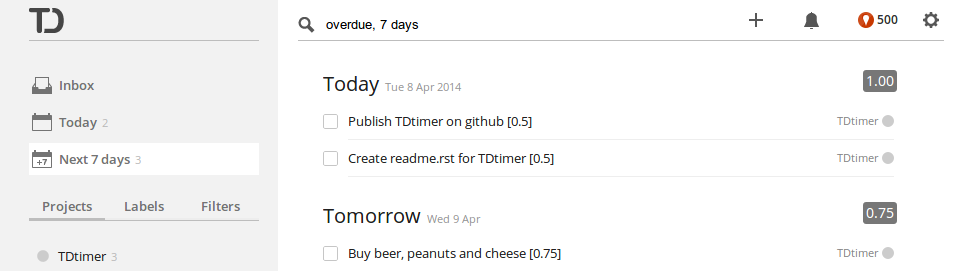

===============
TDtimer
===============

TDtimer is a simple Greasemonkey script that adds basic support for task
duration into `Todoist <http://todoist.com>`_.

---------------
Installation
---------------

Firefox
=========

To install TDtimer into Firefox, you need the `Greasemonkey extension
<https://addons.mozilla.org/en-US/firefox/addon/greasemonkey/>`_. After
installing Greasemonkey, just download the file ``tdtimer.user.js`` and open
it in Firefox using ``File``-``Open File``. You will be asked for confirmation
of the installation, which is normal.

Chrome
========

Starting with some particular version, Chrome developers decided to protect
users from themselves and started blocking user scripts. However, there is still
a way to easily install TDtimer in Chrome. Open ``Settings``-``Extensions`` and
activate the developer mode. You can then drag&drop the ``tdtimer.user.js`` script
onto the ``Extensions`` page to install it. Again, you will be asked for
permission to do so.

Other browsers
================

I am not sure who would seriously consider using a different browser :) but if
you do, you will have to find for yourself if there is a way to install
Greasemonkey scripts in your browser.

---------------
How to use it
---------------

After installation, all is ready, just add some duration info to your tasks
in Todoist.

To add duration information to a task, just give the duration in hours in
square brackets as part of the task text. For example ``Replace Windows XP with
Linux [0.75]``. Please note that the number uses a standard decimal notation, not
time notation (e.g. [0:45]). I believe that anyone intelligent enough to use
task management can handle conversion between minutes and parts of hour and this
way it is possible to use TDtimer for other purposes as well (such as assigning
difficulty or some other value) or use different units, such as minutes, days or
years.

When you assign duration to your tasks, it will be summed for you for today
(in today view), each day (in week view) or each sub-project (in project view).
When you complete or add tasks, the duration will be automatically recalculated.

-----------------------
How to report errors
-----------------------

I have created TDtimer for my own purposes and it works well for me. If you find
an error, you can let me know at <beda(at)zirael.org> or fix it and send me a merge
request on GitHub. I cannot guarantee that I will fix any errors in the future
or provide any support - the software is offered as is.

© 2014-2016 WTFPL – Do What the Fuck You Want to Public License.
